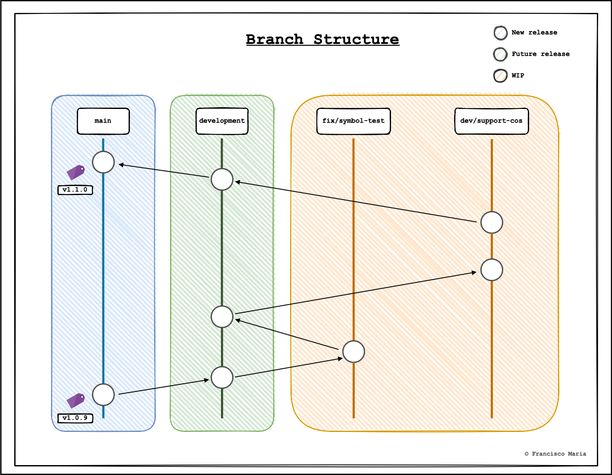

# Contribution Guidelines

## Table Of Contents

- [Introduction](#Introduction)
- [Getting Started](#Getting-Started)
  - [Prerequisites](#Prerequisites)
  - [Installation](#Installation)
- [Repository Structure](#Repository-Structure)
  - [Packages](#Packages)
  - [Branches](#Branches)
- [Workflow](#Workflow)
  - [Commits](#Commits)
  - [Pull Requests](#Pull-Requests)
  - [Versioning System](#Versioning-System)
  - [Releases](#Releases)

## Introduction

Thank you for your interest in helping to develop and leverage even more the power of MaTheX2Java. We are really eager to have you here! This project focuses on providing not only a functional but a maintainable and scalable application which provides its users and developers a great experience. In order to offer this a set of guidelines were defined so that these are followed and respected by each contributor of this project. Please carefully read through them and if in any doubts feel free to open an issue.

## Getting Started

### Prerequisites

Before the installation of the application it is recommended to have the Jar of Antlr4 in order to generate the grammars targets used by the application to successfully complete the translation.

1. Install Antlr4 v4.7.2 (Jar).

This version of antlr4 can be found here: https://repo1.maven.org/maven2/org/antlr/antlr4/4.7.2/. After succesful installation of the Jar update your classpath to easily run it:

```bash
# Export the Classpath + Setup aliases (This should be in .zshrc/.bash_profile)
# The jar can be downloaded here: https://repo1.maven.org/maven2/org/antlr/antlr4/4.7.2/

export CLASSPATH=".:/usr/local/lib/antlr-4.7.2-complete.jar:$CLASSPATH"
alias antlr4='java -Xmx500M -cp "/usr/local/lib/antlr-4.7.2-complete.jar:$CLASSPATH" org.antlr.v4.Tool'
alias grun='java -Xmx500M -cp "/usr/local/lib/antlr-4.7.2-complete.jar:$CLASSPATH" org.antlr.v4.gui.TestRig'
```

### Installation


1. Pull necessary dependencies.

`$ npm install`

### 

## Repository Structure

This repository has a specific structure which every contributor should respect. 

### Branch Structure



There are two main branches in this repository

- `main`: used for promotion of changes to the live environment (clients). Each merge to this branch must be accompanied by a new releaase of the product.
- `development`: used for aggregating changes to be pushed to `master` for deployment of a new version of the application (beta stage). Note that before pushing to master all the action items/features for a specific version must be first implemented. This however is overriden when a hotfix is to be deployed.

When developing new features, bug fixes or any other change a new branch forked from `development` must be created. Ideally this should be one per issue.
These shall follow a naming format:

- `fix/<succint-name>`: used for fixing bugs or unwanted issues.
- `dev/<succint-name>`: used for refactors and development-related issues (e.g. testing).
- `feature/<succint-name>`: used for the implementation of features.


## Versioning System


## Commit Messages